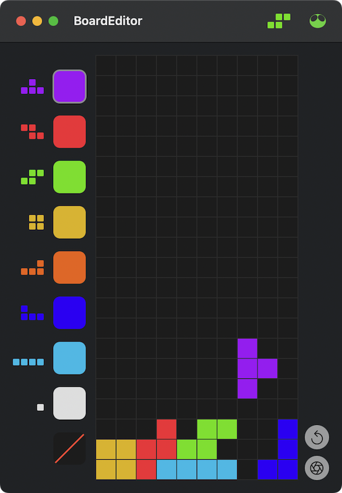
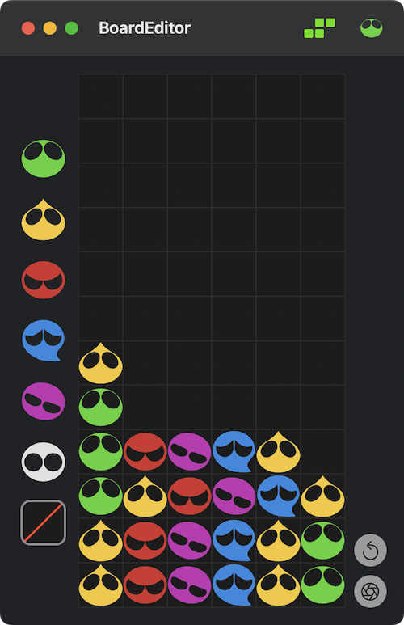

# BoardEditor.app

テトリスとぷよぷよの盤面を再現するエディターです。  
テトリスとぷよぷよの戦略を練って訓練するために使えます。

- テトリミノの色やぷよを選んで盤面をなぞることで描画できます。
- リセットボタンで全てを消すことができます。
- 盤面を PNG 画像として保存することができます。

## ダウンロード

- [Release](https://github.com/Kyome22/BoardEditor/releases)から最新版の`.dmg`ファイルをダウンロードしてアプリをインストールしてください。
- macOS 12 以上で動作します。

## ライセンス

テトリス（Tetris）の知的財産権はテトリス・ホールディング（Tetris Holding, LLC）が保有し、ザ・テトリス・カンパニー（The Tetris Company, LLC）が管理しています。
また、ぷよぷよ（Puyo Puyo）の知的財産権は株式会社セガ（SEGA CORPORATION）が保有・管理しています。
そのため、本ソースコードを商用利用することは禁止いたします。
